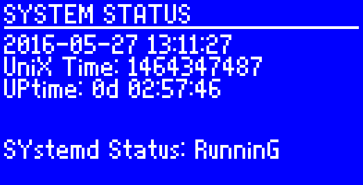
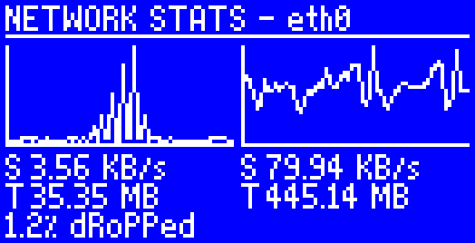
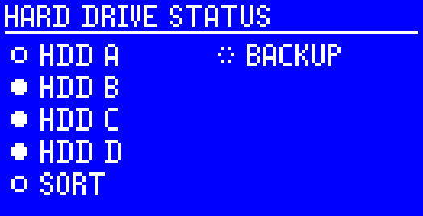
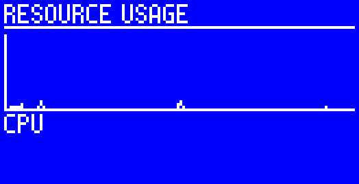

srvmon
======

LCD display server monitor

Current state
-------------

The project isn't finished yet, the screenshots
also don't reflect the newest state of the project.

Screenshots
-----------

